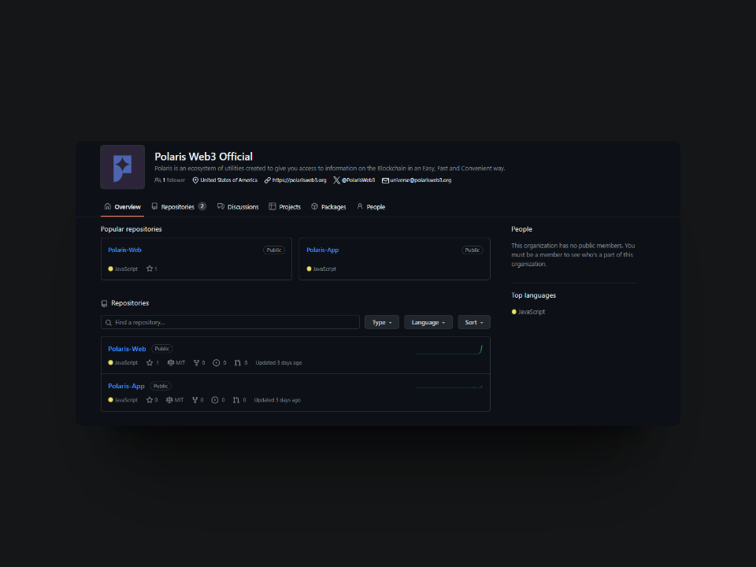

# 👩‍💻 Polaris Dev

<figure><figcaption></figcaption></figure>

## 📖 Polaris Open Source&#x20;

All tools developed by Polaris are open source and fully public. This means that anyone can access, review, modify and redistribute the source code of our tools. We strongly believe in transparency and community collaboration as pillars for secure and effective software development. <mark style="color:blue;">Our projects are hosted on code hosting platforms such as GitHub, facilitating access and contribution from the global community.</mark>&#x20;

This open source policy fosters an active and participatory community, where users can not only benefit from our tools but also contribute to improve them and adapt them to new needs. Open source is fundamental to us at Polaris, as it enables continuous innovation and collaborative development, ensuring that our tools are of the highest quality and accessible to all.
