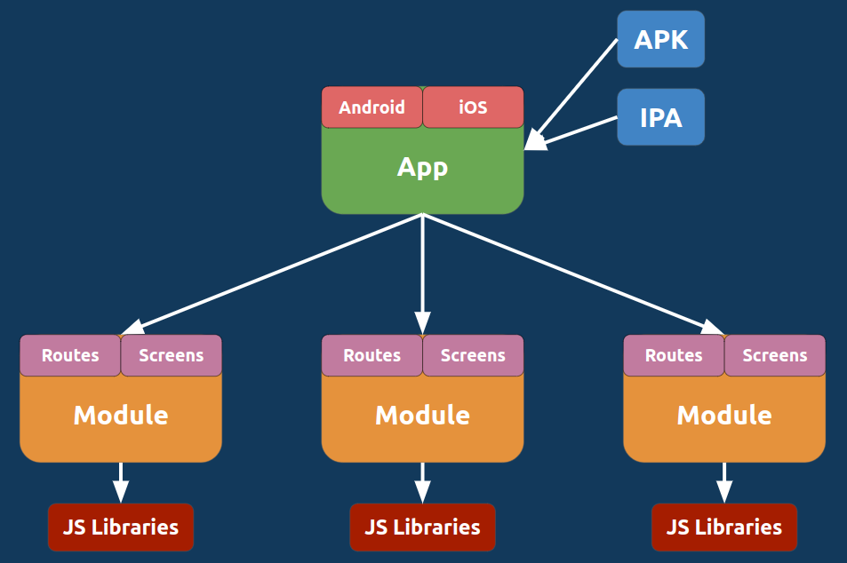

# 🧑‍💻 Tecnología&#x20;

<figure><figcaption></figcaption></figure>

React Native es la tecnología elegida para impulsar la aplicación móvil de Polaris. Es un marco de desarrollo de código abierto creado por <mark style="color:yellow;">Facebook</mark> que permite construir aplicaciones móviles nativas utilizando JavaScript y React, una biblioteca de interfaz de usuario también desarrollada por Facebook. React Native ha ganado popularidad en la comunidad de desarrollo de aplicaciones móviles debido a su eficiencia, versatilidad y capacidad para crear aplicaciones de alta calidad tanto para iOS como para Android desde una base de código compartida.

***

### **¿Qué es React Native y cómo funciona?**

React Native es una tecnología de desarrollo de aplicaciones móviles que permite a los desarrolladores crear aplicaciones nativas utilizando componentes de interfaz de usuario declarativos y un enfoque basado en componentes. Utiliza JavaScript como lenguaje de programación, lo que facilita la creación de aplicaciones móviles utilizando un conocimiento previo de esta tecnología.'

<figure><figcaption></figcaption></figure>

Funciona mediante la compilación de componentes de React en componentes nativos de iOS y Android, lo que permite que las aplicaciones creadas con React Native tengan un rendimiento similar al de las aplicaciones desarrolladas de forma nativa. React Native utiliza un hilo de fondo separado para ejecutar JavaScript, lo que permite una interfaz de usuario receptiva y sin bloqueos.

***

#### **Ventajas de React Native:**

<table data-view="cards"><thead><tr><th></th><th></th><th></th></tr></thead><tbody><tr><td><strong>Desarrollo multiplataforma</strong></td><td>-</td><td>Permite crear aplicaciones para iOS y Android desde una sola base de código. Lo que a su ves facilita la lectura del codigo y permite u ambiente laboral saludable y escalable.</td></tr><tr><td><strong>Eficiencia y productividad</strong></td><td>-</td><td>React Native simplifica el proceso de desarrollo al permitir utilizar JavaScript, una amplia gama de bibliotecas y herramientas, y un enfoque basado en componentes.</td></tr><tr><td><strong>Rendimiento</strong></td><td>-</td><td>Las aplicaciones creadas con React Native pueden tener un rendimiento similar al de las aplicaciones nativas, gracias a la compilación de componentes en código nativo.</td></tr></tbody></table>

**Desventajas de React Native:**

<table data-view="cards"><thead><tr><th></th><th></th><th></th></tr></thead><tbody><tr><td><strong>Limitaciones nativas</strong></td><td>-</td><td>Aunque React Native permite crear aplicaciones nativas, puede haber limitaciones en algunas características y funcionalidades específicas de las plataformas.</td></tr><tr><td><strong>Dependencia de terceros</strong></td><td>-</td><td>Algunas funcionalidades pueden requerir el uso de bibliotecas de terceros, lo que puede añadir complejidad y riesgo al proyecto.</td></tr><tr><td></td><td></td><td></td></tr></tbody></table>

***

### **Misión de Polaris utilizando React Native:**

> La elección de React Native para desarrollar la aplicación móvil de Polaris refleja la misión del proyecto de proporcionar una experiencia de usuario de alta calidad y accesible para la comunidad Web3. Al utilizar React Native, buscamos aprovechar las ventajas de eficiencia, productividad y rendimiento de esta tecnología para ofrecer una aplicación móvil intuitiva y potente que satisfaga las necesidades de los usuarios en iOS y Android.

Además, al optar por React Native, Polaris se posiciona para aprovechar la comunidad activa y las amplias herramientas y bibliotecas disponibles para esta tecnología, lo que facilita el desarrollo y la evolución continua de la aplicación móvil en línea con las necesidades y expectativas de la comunidad Web3.
