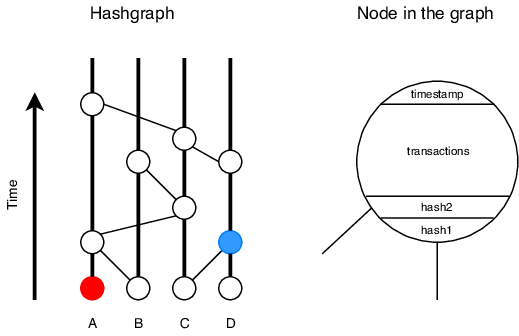
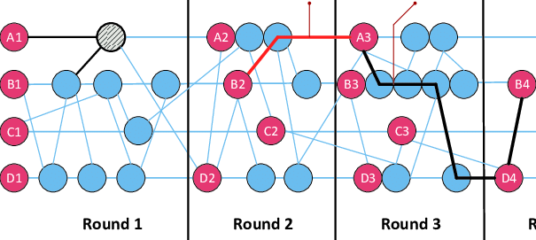

# 📌 Introducción&#x20;

Hedera Hashgraph emerge como un pionero en el ámbito del consenso distribuido, destacando por su innovador protocolo <mark style="color:yellow;">Hashgraph</mark>. Este protocolo, basado en conceptos matemáticos sólidos, redefine las capacidades de las redes blockchain al ofrecer un enfoque altamente eficiente y seguro para la validación de transacciones. En esta introduccion, explicaremos a profundidad cómo funciona Hashgraph y cómo se aplica en la red de Hedera, además de examinar sus aplicaciones prácticas en diversos sectores.


Esto lo hacemos con el objetivo de explicar porque elegimos a Hedera como la Blockchain madre del ecosistema Polaris.


#### El Algoritmo de Consenso Hashgraph

En el corazón del protocolo Hashgraph se encuentra su algoritmo de consenso, que utiliza una combinación de <mark style="color:yellow;">grafo</mark> de eventos, <mark style="color:yellow;">gossip</mark> <mark style="color:yellow;">protocol</mark> y mecanismo de consenso para alcanzar un acuerdo entre los nodos de la red.

* **Grafo de Eventos**: Hashgraph representa la historia de las transacciones como un grafo dirigido acíclico, donde cada nodo representa un evento que incluye la información sobre las transacciones y el orden en que ocurrieron. Este enfoque permite una trazabilidad completa de las transacciones, garantizando la integridad y sobre todo la consistencia de la red.
* **Gossip Protocol**: Los nodos en la red Hashgraph se comunican entre sí utilizando un protocolo de difusión de información llamado gossip protocol. Este mecanismo permite que los nodos compartan información sobre eventos y transacciones de manera aleatoria y eficiente, lo que garantiza una rápida propagación de la información en toda la red.
* **Mecanismo de Consenso**: Hashgraph utiliza un algoritmo de consenso asincrónico llamado el algoritmo de votación del consenso del Hashgraph. Este algoritmo permite que los nodos lleguen a un consenso sobre el orden de las transacciones mediante un proceso de votación ponderada, donde cada nodo emite votos sobre el orden de los eventos basados en la información que han recibido a través del gossip protocol.

***

Imagina Hashgraph como una especie de gran red de comunicación donde todos los nodos están hablando constantemente entre sí. Cada vez que un nodo hace una transacción, la comparte con algunos otros nodos, y estos a su vez la comparten con otros nodos más, como un rumor que se va propagando por toda la red. Este proceso de compartir información se llama gossip protocol.

<figure><figcaption></figcaption></figure>

Pero aquí es donde se pone interesante. En lugar de simplemente compartir la información de la transacción, los nodos también incluyen información sobre cuándo recibieron la transacción y de quién la recibieron. Esto crea un registro cronológico de todas las transacciones en la red, que se parece mucho a un grafo de eventos, donde cada evento es una transacción y las flechas entre ellos muestran el orden en que ocurrieron.

<figure><figcaption></figcaption></figure>

Ahora, ¿cómo llegamos a un consenso sobre el orden de estas transacciones? Bueno, aquí es donde entra en juego el algoritmo de consenso de Hashgraph. Los nodos votan sobre el orden de las transacciones en función de la información que han recibido a través del gossip protocol. Pero no es solo un voto simple, cada nodo emite múltiples votos ponderados basados en el tiempo en que recibieron la información y la reputación del nodo que les envió la información. Esto ayuda a prevenir el problema del doble gasto y asegura que todos estén de acuerdo en el orden de las transacciones.

<figure><figcaption></figcaption></figure>

El cálculo matemático detrás de estos votos ponderados puede ser un poco complejo, pero básicamente se reduce a asignar un peso a cada voto en función de estos dos factores. Por ejemplo, si un nodo recibe la información sobre una transacción temprano en el proceso y viene de un nodo con una alta reputación, su voto tendrá un peso considerable. Por otro lado, si un nodo recibe la información tarde o viene de un nodo con una reputación cuestionable, su voto tendrá menos peso.

***

El algoritmo de consenso de Hashgraph utiliza estos votos ponderados para calcular un "tiempo virtual" para cada evento en el grafo de eventos. Este tiempo virtual representa el consenso de la red sobre cuándo ocurrió cada evento y, por lo tanto, el orden de las transacciones.


"ponderado" significa que se asigna un valor o peso específico a cada voto emitido por un nodo en la red. Este peso se determina en función de ciertos factores, como el tiempo en que se recibió la información y la reputación del nodo que la envió.


***

#### Aplicaciones Prácticas en la Red de Hedera

La red de Hedera aprovecha el poder del protocolo Hashgraph para ofrecer una plataforma blockchain de alto rendimiento con una amplia gama de aplicaciones en diversos sectores.

* **Finanzas Descentralizadas (DeFi)**: Hedera Hashgraph proporciona una base sólida para aplicaciones DeFi al ofrecer transacciones rápidas y seguras, así como contratos inteligentes escalables. Esto permite la creación de plataformas de préstamos, intercambios descentralizados y sistemas de pago eficientes.
* **Gestión de Identidad**: La capacidad de Hashgraph para gestionar grandes volúmenes de transacciones con alta velocidad y seguridad lo hace ideal para aplicaciones de gestión de identidad. Hedera puede ser utilizado para desarrollar sistemas de identidad digital seguros y verificables que aborden problemas como el fraude y la usurpación de identidad.
* **Supply Chain y Logística**: La trazabilidad y transparencia inherentes a Hashgraph son fundamentales para aplicaciones de supply chain y logística. Hedera puede utilizarse para rastrear el movimiento de productos desde su origen hasta su destino final, garantizando la autenticidad y la integridad de la información en cada etapa del proceso.

<figure><figcaption></figcaption></figure>

Hedera Hashgraph representa un avance significativo en el campo del consenso distribuido, ofreciendo un enfoque <mark style="color:yellow;">eficiente</mark> para la validación de transacciones en redes blockchain. Su protocolo Hashgraph proporciona una base sólida para una amplia gama de aplicaciones en sectores como finanzas, identidad y logística.
