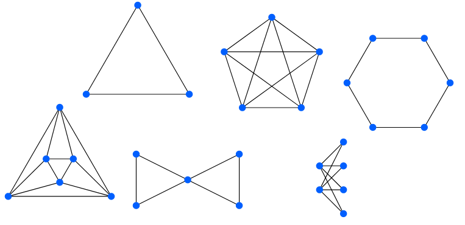
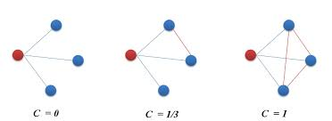

# 🪮 Teoria de Grafos

<figure><figcaption></figcaption></figure>

La teoría de grafos es un campo fascinante de las matemáticas y la informática que estudia las relaciones entre objetos a través de la representación gráfica de estos objetos y las conexiones entre ellos. En este parte de la introduccion, vamos a entender un poco mejor los conceptos fundamentales de la teoría de grafos y explorar sus aplicaciones en una variedad de disciplinas y sobre todo, como la teoria de grafos esta tan relacionada con Hedera.


Hemos creado esta explicación con el objetivo de que los usuarios de Polaris comprendan a profundidad como funciona Hedera.


### Conceptos Fundamentales de la Teoría de Grafos

* **Nodos y Arcos**: En la teoría de grafos, los objetos se representan como nodos, mientras que las relaciones entre estos objetos se representan como arcos. Estos arcos pueden ser dirigidos, donde hay una dirección definida entre los nodos, o no dirigidos, donde la relación es simétrica.
* **Grafos Dirigidos y No Dirigidos**: Los grafos pueden ser dirigidos o no dirigidos dependiendo de si los arcos tienen una dirección específica o no. En los grafos dirigidos, la relación entre dos nodos puede ser asimétrica, mientras que en los grafos no dirigidos, la relación es simétrica.
* **Ciclos y Caminos**: Un ciclo en un grafo es una secuencia de nodos donde el primer y el último nodo son el mismo, y cada nodo en la secuencia está conectado al siguiente. Por otro lado, un camino es una secuencia de nodos donde cada nodo está conectado al siguiente, pero no necesariamente forman un ciclo.


Curso completo de Teoria de Grafos creado por [Free Code Camp](https://www.freecodecamp.org/).


[FreeCodeCamp](https://www.freecodecamp.org/) es una organización sin ánimo de lucro consistente en una plataforma web de enseñanza interactiva accesible para todo el mundo, ​ una comunidad en línea de chats y diversas publicaciones y organizaciones locales que pretenden hacer de la enseñanza del desarrollo algo accesible a todas las personas.

Desde Polaris sugerimos ver este video para continuar aprendiendo sobre Hedera y su ecosistema.

***

### Aplicaciones de la Teoría de Grafos

* **Redes Sociales**: La teoría de grafos se utiliza extensamente en el análisis de redes sociales para entender las relaciones entre individuos. Los nodos representan personas, y los arcos representan conexiones entre ellas, como amistades o interacciones.
* **Rutas de Transporte**: En el ámbito de la logística y la planificación de rutas, la teoría de grafos se utiliza para encontrar la ruta más corta o eficiente entre dos puntos. Los nodos pueden representar ubicaciones y los arcos representan las rutas disponibles entre ellas.
* **Biología Computacional**: En biología computacional, la teoría de grafos se utiliza para modelar y analizar interacciones entre moléculas, proteínas y genes. Esto ayuda a comprender mejor los procesos biológicos y a desarrollar tratamientos médicos más efectivos.

***

### Explorando la Conexión entre la Teoría de Grafos y Hedera Hashgraph

La teoría de grafos y Hedera Hashgraph están estrechamente relacionados en el ámbito de las redes descentralizadas y la criptografía. Vamos a profundizar en esta conexión y ver cómo la teoría de grafos se aplica en el contexto de Hedera Hashgraph.

<figure><figcaption></figcaption></figure>

#### Relación con la Teoría de Grafos

* **Grafo de Eventos de Hashgraph**: En Hedera Hashgraph, el registro de transacciones se representa como un grafo de eventos, donde cada nodo del grafo representa una transacción y las conexiones entre los nodos reflejan el orden en que ocurrieron las transacciones. Esta estructura se asemeja a un grafo en la teoría de grafos, donde los nodos y los arcos representan objetos y relaciones respectivamente.
* **Análisis de Relaciones**: La teoría de grafos proporciona herramientas y técnicas para analizar las relaciones entre los nodos en un grafo. En el contexto de Hedera Hashgraph, estas herramientas pueden aplicarse para entender la estructura y la dinámica del grafo de eventos, lo que ayuda a garantizar la seguridad y la integridad de la red.

#### Ejemplo Práctico: Consenso Distribuido en Hedera Hashgraph

1. **Modelado del Grafo de Eventos**: Cada transacción en la red de Hedera Hashgraph se representa como un nodo en el grafo de eventos, y las relaciones entre los nodos reflejan el orden en que ocurrieron las transacciones.
2. **Aplicación de Algoritmos de Grafos**: Utilizando técnicas de la teoría de grafos, como algoritmos de búsqueda de caminos o análisis de centralidad, los nodos en el grafo de eventos pueden ser analizados para identificar la validez y el consenso de las transacciones.
3. **Consistencia y Seguridad**: Al comprender la estructura del grafo de eventos y las relaciones entre los nodos, se puede garantizar la consistencia y la seguridad de la red de Hedera Hashgraph, lo que permite un consenso distribuido confiable y eficiente.

***

