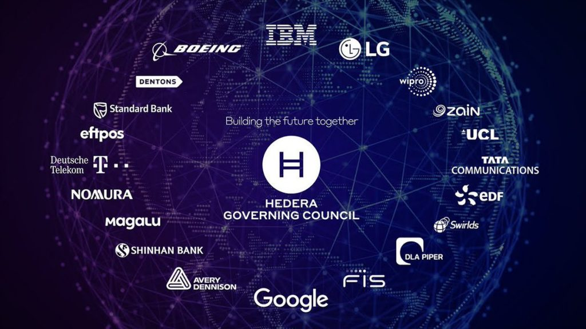

# 📍 Objetivos&#x20;

<figure><figcaption></figcaption></figure>

Seleccionamos a Hedera como nuestra Blockchain madre porque creemos que presenta la tecnología mas revolucionaria hasta el momento dentro del ecosistema Web3. Soportando mas de 10,000 transacciones por segundo y con un costo promedio de transaccion de  $0.0001, es sin duda alguna la Blockchain mas revolucionaria que presenta ahora mismo el ecosistema Web3. Ademas que al estar respaldado por diversas empresas multinacionales pueden garantizar la seguridad y escalabilidad de la red al muy largo plazo.

***

### El principal problema de Hedera

Pero como toda revolucion tecnologica tambien presenta diversos problemas dentro de la misma. Y el principal de ellos es la dificultad en su adopción debido a su tecnología. Hedera presenta una tecnología muy compleja y difícil de entender para un usuario promedio que tiene pocos conocimiento sobre Web3. Por lo tanto decidimos que nuestra principal misión dentro de la red sera desarrollar herramientas de aprendizaje.

Herramientas mediante cualquier persona pueda entender como funciona el ecosistema de Hedera o desarrollar su propia aplicación dentro del ecosistema usando esta fantástica tecnología sin necesidad de aprender teorías complejas.
