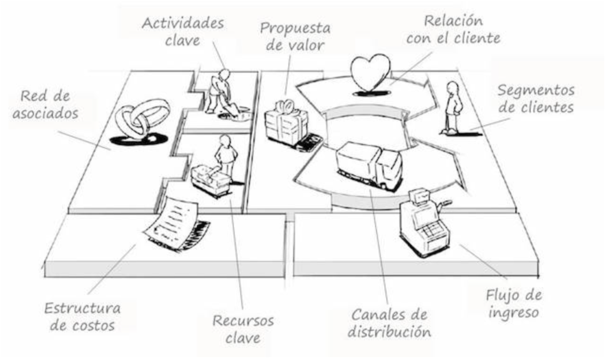

# 🏦 Modelo de negocio

<figure><figcaption></figcaption></figure>

En el panorama emergente de la Web3, donde la tecnología blockchain y las criptomonedas están transformando la forma en que interactuamos en línea, Polaris se presenta como un ecosistema integral de utilidades diseñado para satisfacer las necesidades de esta comunidad en constante evolución. Tenemos para Polaris una visión clara de cómo monetizar el proyecto, combinando diferentes modelos de negocio para garantizar su <mark style="color:green;">**sostenibilidad**</mark> a largo plazo.

***

### **1. Venta de Servicios de Desarrollo de Software:**

El núcleo del modelo de negocio de Polaris se basa en la venta de servicios de creación y desarrollo de software, con un enfoque específico en la comunidad Web3. La escasez de oferta en este sector, especialmente en el mercado hispanohablante, presenta una oportunidad única para Polaris. Nuestro equipo de desarrolladores ofrece servicios personalizados para satisfacer las necesidades de empresas y proyectos dentro de la Web3 pero específicamente fuera de ella. Desde el desarrollo de aplicaciones descentralizadas (dApps) hasta la implementación de soluciones blockchain, Nuestro principal objetivo es posicionar a Polaris como un socio estratégico para aquellos que buscan incursionar en el mundo descentralizado.


No nos quedaremos esperando a que nos vengan a contactar. Nosotros directamente iremos a dichas empresas y le ofreceremos soluciones tecnológicas innovadoras basadas en Blockchain.&#x20;


> _<mark style="color:blue;">Misión</mark>:_ La misión de Polaris en este modelo de negocio es impulsar la adopción de la Web3 al proporcionar servicios de alta calidad y soluciones innovadoras. Su enfoque en el mercado hispanohablante busca llenar el vacío existente en la oferta de servicios de desarrollo de software centrados en la blockchain, brindando a las empresas y proyectos las herramientas necesarias para prosperar en este nuevo paradigma tecnológico.

_<mark style="color:orange;">Competencia</mark>:_ Aunque la competencia en el sector hispanohablante puede ser limitada en comparación con otras regiones, Polaris se enfrenta a desafíos por parte de empresas establecidas en el ámbito global y proyectos emergentes que también buscan posicionarse como líderes en la Web3 como ejemplo:

<table data-view="cards"><thead><tr><th></th><th></th><th data-type="rating" data-max="5"></th></tr></thead><tbody><tr><td><a href="https://www.youtube.com/@coleccion_nft">Coleccion NFT</a> es una empresa residente en  España que ofrece soluciones tecnologicas basadas en Blockchain. </td><td>-</td><td>5</td></tr><tr><td><a href="https://nftes.es/">NFTes</a> un proyecto que ofrece soluciones tecnologicas basadas en Blockchain para empresas y nuevos proyectos.</td><td>-</td><td>4</td></tr><tr><td><a href="https://twitter.com/WhataLab_">@WhataLab</a> un proyecto basado en la Blockchain de Hedera, el cual tambien ofrece soluciones tecnologicas.</td><td>-</td><td>3</td></tr></tbody></table>

&#x20;Aunque esta no nos afectara en lo absoluto, mas información en [Validacion](validacion.md).

***

### **2. Venta de Colección NFT y Beneficios Asociados:**

Como parte de nuestra estrategia de financiación inicial y para involucrar a la comunidad desde el inicio, Polaris lanzara una colección de NFT <mark style="color:green;">(tokens no fungibles)</mark>. Estos NFT no solo representan piezas únicas de arte digital, sino que también otorgan beneficios exclusivos a sus poseedores. Además de contribuir al desarrollo continuo de Polaris, los poseedores de NFT reciben descuentos en los servicios ofrecidos por nuestro equipo de desarrollo adicionalmente del acceso exclusivo a los productos del ecosistema.


Mas información sobre dicha colección en  ->  [NFTs](../nfts.md)


> _<mark style="color:green;">Misión</mark>:_ La misión de Polaris con la venta de la colección NFT es doble: por un lado, buscar financiación para impulsar el desarrollo y la expansión del ecosistema; por otro lado, fomentar la participación y la lealtad de la comunidad al ofrecer beneficios tangibles a los poseedores de cada pieza. Esta estrategia no solo fortalece el vínculo entre Polaris y su comunidad, sino que también promueve la adopción de las herramientas y servicios del ecosistema.

***

### **3. Publicidad Contextualizada:**

Para garantizar la sostenibilidad financiera a largo plazo, Polaris también planea integrar publicidad contextualizada dentro de sus diferentes utilidades. Esta publicidad estará cuidadosamente diseñada para ofrecer valor añadido a los usuarios, evitando la intrusión y la molestia asociadas con la publicidad genérica. Al mantener la relevancia y la coherencia con el contenido y las necesidades de la comunidad Web3, Polaris busca generar ingresos adicionales sin comprometer la experiencia del usuario.


Mas información sobre dicha colección en  ->  [Validacion](validacion.md)


> _<mark style="color:red;">Misión</mark>:_ La misión de Polaris en la integración de publicidad contextualizada es proporcionar una fuente de ingresos complementaria que no afecte negativamente la experiencia del usuario. Al mantener un enfoque en la calidad y la relevancia, Polaris busca generar ingresos de manera ética y sostenible, sin comprometer sus valores fundamentales de transparencia y respeto hacia la comunidad.

***

### **Conclusiones:**

Con el objetivo de establecernos como un actor destacado en el ecosistema Web3, desarrollamos en Polaris una estrategia diversificada de modelos de negocio. Desde la venta de servicios de desarrollo de software hasta la creación de una colección NFT y la integración de publicidad contextualizada.

\
