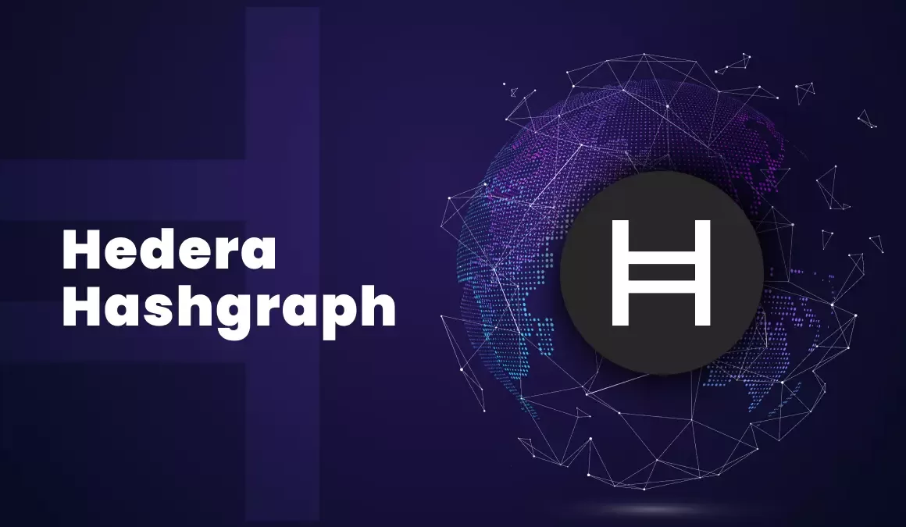

# 🏠 Hedera

<figure><figcaption></figcaption></figure>

We selected Hedera as our parent Blockchain because we believe it presents the most revolutionary technology so far within the Web3 ecosystem. <mark style="color:blue;">Supporting more than 10,000 transactions per second</mark> and with an average transaction cost of $0.0001, it is, without a doubt, the most revolutionary Blockchain in the Web3 ecosystem right now. In addition to being backed by several multinational companies, it can guarantee the security and scalability of the network in the very long term.

***

## [🌉](https://emojiterra.com/es/puente-de-noche/) The main problem of Hedera

But like all <mark style="color:blue;">technological revolution also presents several problems</mark> within it. And the main one of them is the difficulty in its adoption due to its technology. Hedera presents a very complex technology and difficult to understand for an average user who has little knowledge about Web3. Therefore we decided that our main mission within the network will be to develop tools to give old and new users of the network access to information in an Easy, Fast and Convenient.
