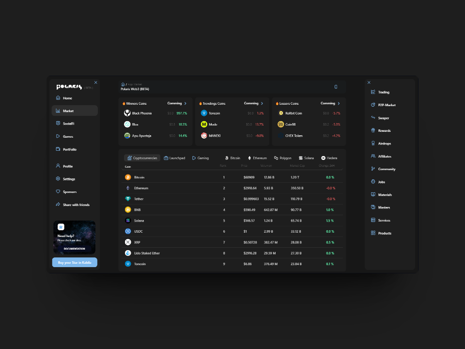

# 📌 Introduction

<figure><figcaption></figcaption></figure>

## ✨ Nuestra Mision&#x20;

La misión de Polaris es proporcionar un ecosistema de herramientas intuitivas y accesibles que le permita a los usuarios de todo el mundo explorar, interactuar y beneficiarse de las oportunidades en el espacio Web3. Buscamos democratizar el acceso a la blockchain, asegurando que la información y las herramientas sean <mark style="color:blue;">Fáciles, Rápidas y Convenientes</mark> para todos.

***

## 🤔 Porque "Facil, Rapida y <mark style="color:blue;">Conveniente</mark>" ?

Para Polaris, estas tres palabras representan la esencia de nuestra misión y señalan el camino para alcanzar nuestra visión de un espacio Web3 accesible para todos.

### 🚦 **Fácil**

Creemos que la tecnología blockchain y el espacio Web3 no deben ser exclusivos de <mark style="color:blue;">expertos</mark> en tecnología. Al hacer nuestras herramientas fáciles de usar, eliminamos las barreras técnicas, permitiendo que cualquier persona, independientemente de su experiencia previa, pueda explorar y beneficiarse del potencial de la blockchain.

### 🚕 **Rápida**

En el mundo digital, el tiempo es un recurso valioso. Queremos asegurar que nuestros usuarios puedan acceder a la información y los servicios que necesitan sin demoras innecesarias. Un acceso rápido no solo mejora la experiencia del usuario, sino que también facilita la toma de decisiones en tiempo real, una ventaja <mark style="color:blue;">crítica</mark> en el dinámico entorno Web3.

### 💸 **Conveniente**

<mark style="color:blue;">La conveniencia es clave para la adopción</mark> y la satisfacción del usuario. Al diseñar soluciones que son convenientes, aseguramos que nuestros usuarios puedan acceder a las herramientas y la información necesaria desde <mark style="color:blue;">cualquier dispositivo</mark>, en <mark style="color:blue;">cualquier momento y lugar</mark>. Esto no solo democratiza el acceso a la blockchain, sino que también integra la tecnología Web3 en la vida cotidiana de las personas de una manera práctica y funcional.

> Estos principios guían el diseño y desarrollo de cada una de nuestras herramientas y servicios en Polaris, asegurando que cumplamos nuestra misión de hacer que el espacio Web3 sea accesible y beneficioso para todos.

***

## &#x20;Como lo conseguiremos [❓](https://emojiterra.com/es/interrogacion-roja/)



La **App móvil de Polaris** es una plataforma intuitiva y fácil de usar diseñada para que los usuarios del ecosistema se mantengan al tanto de todas las noticias "<mark style="color:blue;">relevantes</mark>" que podrían llegar a tener un impacto positivo o negativo en el sector.

### Beta[🟢](https://emojiterra.com/es/circulo-verde/)

* Seguimiento del precio de los activos mas relevantes del sector <mark style="color:blue;">(Sin Humo)</mark> solo le damos importancia a los activos con mayor volumen, de los cuales depende todo el mercado.
* Seguimientos de noticias con una gran relevancia. <mark style="color:blue;">Noticias que pueden mover el mercado</mark> o que realmente podrían <mark style="color:blue;">hacer un cambio en el sector</mark>.

***

### V1.0 [🟡](https://emojipedia.org/es/c%C3%ADrculo-amarillo)

* Análisis estadístico a profundidad de los activos mas relevantes del sector.

La app móvil de Polaris está centrada en la seguridad y la usabilidad, ofreciendo una experiencia fluida para tanto novatos como expertos en el espacio Web3.

<figure><figcaption></figcaption></figure>



El **Portal Web de Polaris** es una plataforma <mark style="color:blue;">integral</mark> que facilita el acceso a información y recursos cruciales sobre el espacio Web3. Funciona como el eje central para explorar, aprender y interactuar con diferentes aspectos del ecosistema, proporcionando herramientas de análisis profundo, la posibilidad de interactuar con la Blockchain de Hive.

### Beta [🟢](https://emojiterra.com/es/circulo-verde/)

* **Información Actualizada:** Acceso a noticias y análisis recientes para mantenerse informado sobre las tendencias del mercado.
* **Herramientas de Análisis:** Funcionalidades que permiten evaluar el rendimiento de distintos activos digitales, optimizando la toma de decisiones.

### V1.0 [🟡](https://emojipedia.org/es/c%C3%ADrculo-amarillo)

* Herramientas de rastreo profundo en la Blockchain de <mark style="color:blue;">Hedera.</mark>
* Herramientas de analisis para los Posts en la Blockchain de <mark style="color:blue;">Hive.</mark>

<figure><figcaption></figcaption></figure>



















