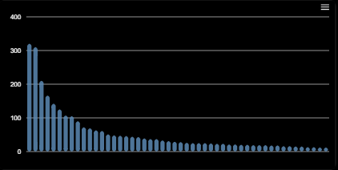
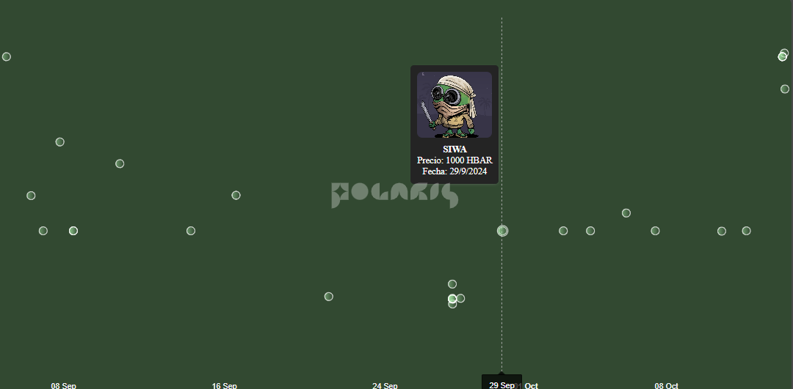
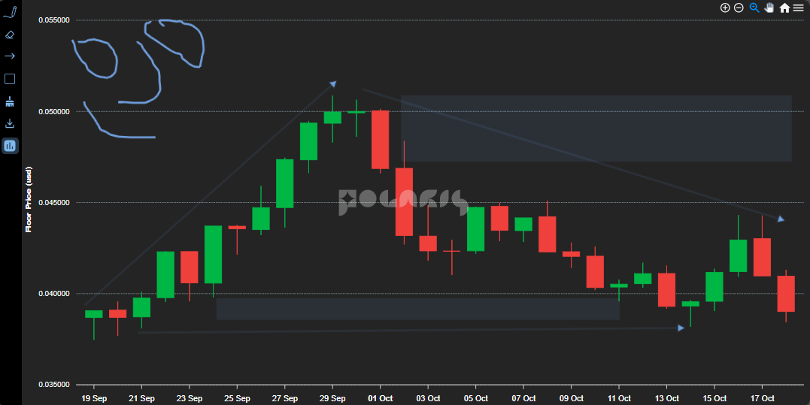

# Poli Charts

<figure><figcaption></figcaption></figure>

## The Problem: Displaying Token and NFT Graphics on Hedera

When trying to display graphics for tokens or NFTs on a website using Hedera, developers often encounter issues with fetching price history, volume, and other essential data. This challenge hinders the seamless visualization of assets, particularly for marketplace projects.

***

## Poly-Charts: Our Solution 🌟

Enter **Poly-Charts**, a JavaScript library crafted by Polaris. Initially conceived for Polaris Web and our mobile app, this powerful tool makes it easy to generate detailed graphs for the Hedera ecosystem. Now open source, it's designed for use with both native JavaScript, simplifying integration across diverse projects.

<figure><figcaption></figcaption></figure>

***

## Benefits for PPASS Holders

If you hold a [PPASS](../polaris/welcome/polaris-pass/), our solution offers you exclusive benefits:

* **Premium Access** to advanced graph features.
* **Priority Support** for seamless integration.
* **Community Contribution**: Enable collaborative development to enhance library features.

<figure><figcaption></figcaption></figure>

***

## How to start?

Using polaris on your website is quite simple, first install the library directly from NPM.


```bash
npm install poli-charts
```


Once it is installed, you can try the different graphics and choose the one you like the most.

```javascript
//NFT Charts
import { NFTOwnersBarChart } from "poli-charts";
import { NFTActivityChart } from "poli-charts";

//Coins Charts
import { CoinSimpleFloorPriceChart } from "poli-charts";
import { CoinComplexFloorPriceChart } from "poli-charts";
import { CoinTradingFloorPriceChart } from "poli-charts";

//NFTs
//An api key is required in SentX
//Case A
NFTOwnersBarChart({
    elementId : "container_testing",
    backgroundColor : "#000000",
    barColor : "#5c8ab4",
    fetchData : {
      apiKey: "35996d57-04b1-4091-9e6f-68337a0c2c1f", // example key
      tokenId: "0.0.2179656",
      amount: 50,
    },
    fontConfig : {
      size: "12px",
      color: "#fff",
    },
})

//Case B
NFTActivityChart({
    elementId : "container_testing",
    backgroundColor : "#242424",
    chartColor : "#FF5733",
    fetchData : {
      apiKey: "9874288b-f768-44d7-9b2c-3bf24c27ad2a", // example key
      tokenId: "0.0.2179656",
      type: "Sales",
    },
})

//Coins
//Case C
CoinTradingFloorPriceChart({ 
    elementId : "container_testing",
    backgroundColor : "#242424",
    chartColor : "#FF5733",
    fetchData : {
      tokenId: "0.0.2179656",
    },
    fontConfig : {
      size: "12px",
      color: "#fff",
    },
})
```

Result for Case A

<figure><figcaption></figcaption></figure>

Result for Case B

<figure><figcaption></figcaption></figure>

Result for Case C

<figure><figcaption></figcaption></figure>

***

<details>

<summary><strong>What platforms support Poly-Charts?</strong></summary>

Initially available on npm, future expansions will include WordPress, Wix, Python, Dart, and Kotlin

</details>

<details>

<summary><strong>Can I contribute to Poly-Charts?</strong></summary>

Absolutely! As an open-source project, we welcome contributions from anyone interested in enhancing the library.

</details>

<details>

<summary><strong>Do I need advanced coding skills to use Poly-Charts?</strong></summary>

Not at all! Poly-Charts is designed for ease of use, accommodating developers of all skill levels.

</details>
