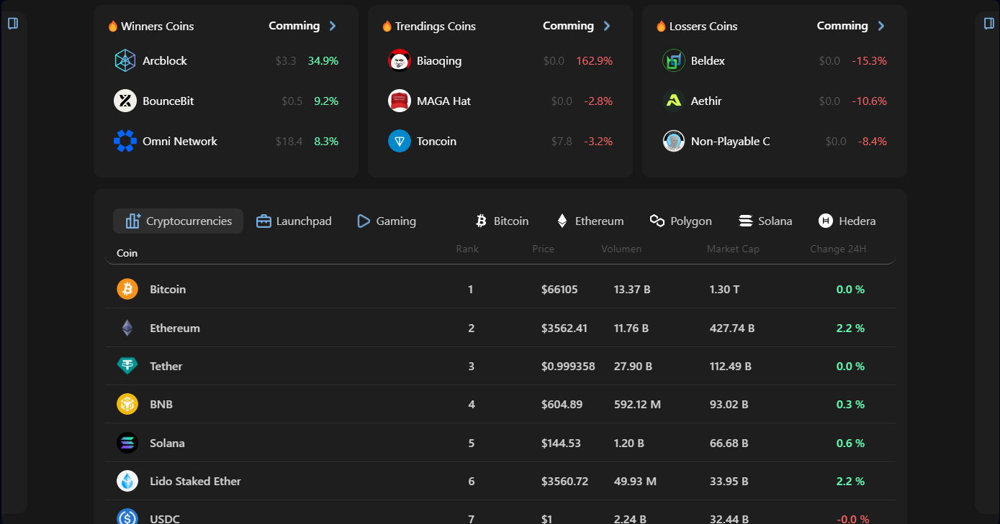

# 📊 Market

<figure><figcaption>
Market Polaris Web3
</figcaption></figure>

The Market section of our platform is designed to provide an overview of the current state of the cryptocurrency and NFT markets. This section is ideal for users who want to quickly and clearly understand market trends without needing complex analysis tools.

### **📊 Key Features:**

1. **General Price Visualization:**
   * This feature allows users to view the general prices of the cryptocurrency market, making it easy to track the values of different coins.
2. **Specific Coin Information:**
   * Users can select a specific coin to see its current price and other relevant metrics.
   * There is an option to add this coin to their personal portfolio for more detailed tracking.
3. **Advanced Filters:**
   * While it does not include advanced analysis tools, the Market section allows filtering data to view coin prices across more than five different blockchains.
   * Users can quickly identify the latest launchpads or tokens that have recently entered the market.
   * The section also enables viewing tokens associated with popular video games, making it easier to identify opportunities in this specific sector.
4. **Winners and Losers:**
   * The section provides a list of the top-performing and worst-performing coins recently, helping users make informed decisions based on market trends.

### **🔍 Technology Used:**

* We use Polaris's internal API, which is responsible for collecting and processing market data. This API ensures that users receive accurate and up-to-date information about the cryptocurrency and NFT markets.

### **📉 User Benefits:**

* **Accessibility and Simplicity:** The section is designed to be intuitive and easy to use, even for those who are not cryptocurrency experts.
* **Updated Information:** Thanks to the Polaris API, the data presented is always up-to-date, allowing users to make decisions based on recent information.
* **Customization:** The ability to add coins to a personal portfolio and use advanced filters allows users to customize their experience and focus on the data that interests them most.
