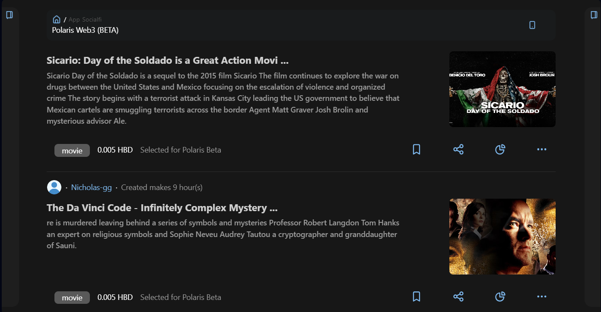

# 🐦 SocialFi

<figure><figcaption>
SocialFi Polaris Web3
</figcaption></figure>

The SocialFi section of our platform is the access to Polaris' BETA social network, built on Hive Blockchain technology. This section allows users to interact with social content in a decentralized way, with functionalities that will be expanded in future versions to offer a complete experience.

***

### ✊Current Features:

1. Latest Posts and Trending Posts:
   * Users can view the most recent posts and those that are trending within the community.
2. Top Accounts:
   * A list of the most influential accounts is presented, allowing users to discover and follow top content creators.
3. Search and Filtering:
   * Users have the ability to search for posts using keywords and apply filters to find specific content.
4. Post Details:
   * Each post can be viewed in detail, including information about the author, comments received and interaction with the post.

***

### 👊 Future Features:

1. **V 1.0:**
   * Save Posts: Users will be able to save posts for later review.
   * Post Statistics: Detailed statistics on the interaction and reach of each post will be provided.
   * Deep Tracking: Will allow for advanced analysis of post performance, including advanced statistics and average content lifespan.
2. **V 2.0:**
   * Account Creation: Users will be able to create accounts directly in Hive Blockchain through our platform.
   * Post Creation and Commenting: The functionality to create posts, comment on existing posts and vote positively or negatively on the content will be enabled.
   * Full Interaction: This version will transform the section into a complete social network, allowing full and decentralized interaction with other users and content.

***

### 🤌 Technologies used:

* The SocialFi section connects directly to the Hive Blockchain without intermediaries, ensuring a secure, transparent and decentralized experience. This allows users to interact with the platform efficiently and reliably.

***

### 💪 User Benefits:

* Decentralized Access: Integration with Hive Blockchain provides a secure and transparent environment for social interaction.
* Real-Time Information: The ability to view the latest posts and trending posts keeps users up to date with the most relevant content.
* Search and Filtering Tools: These functionalities facilitate the navigation and discovery of specific content.
* Future Expansions: Upcoming updates promise to significantly improve functionality and interaction, offering advanced tools and a complete social networking experience.

The SocialFi section is designed to evolve over time, providing users with more and more tools to interact effectively and meaningfully with the community in a decentralized environment.
